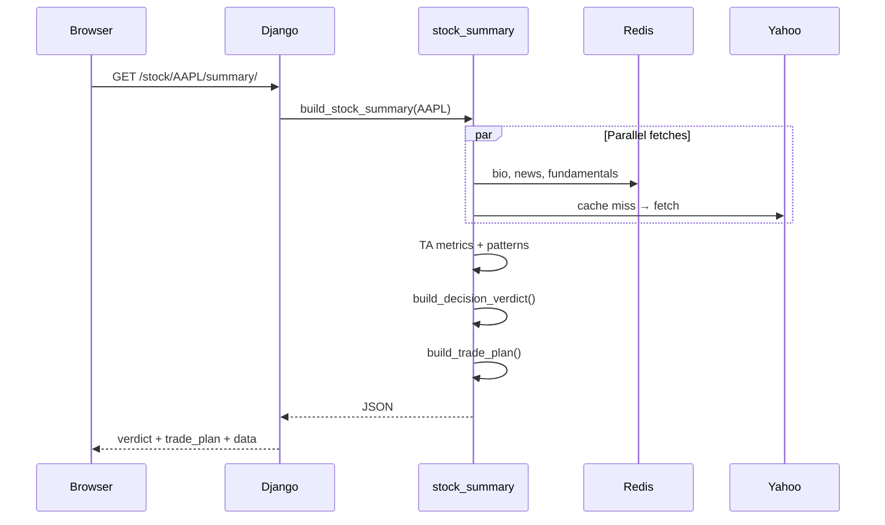

# Architecture overview

## Request flow (stock page)

## Services layer

| Service | Responsibility |
|---------|----------------|
| `stock_data.py` | Yahoo fetches: bio, news, fundamentals, holders, earnings, charts |
| `technical_metrics.py` | TA: crossover, ADX, Bollinger, RSI, pivots, candle/harmonic patterns |
| `economic_calendar.py` | Macro calendar fetch + cache |
| `screener_cache.py` | Cache Yahoo screeners; Celery refresh |
| `stock_summary.py` | Orchestrate parallel fetches + verdict + trade plan |
| `decision_verdict.py` | Buy / Hold / Sell verdict |
| `trade_plan.py` | Entry, stop, targets, position hint |
| `portfolio.py` | User holdings summary and serialization |
| `peers.py` | Peer comparison and financial-health peer rows |
| `news_sentiment.py` | VADER scoring for Yahoo news headlines |

Views in `frontend_app/views.py` are thin HTTP wrappers: validate symbol, call service, return `JsonResponse`. Shared helpers live in `symbols.py`, `http_responses.py`, and `view_helpers.py`.

User APIs (`watchlist`, `trading-prefs`, `portfolio`) live in `users/*_views.py` and are mounted at the site root via `users/urls.py`.

## Docker services

| Service | Role |
|---------|------|
| `web` | Django (dev: runserver, prod: Gunicorn) |
| `nginx` | Production reverse proxy + static files |
| `worker` | Celery tasks |
| `beat` | Scheduled screener refresh |
| `db` | PostgreSQL |
| `redis` | Cache, sessions, Celery broker |

## Key endpoints

See [README](../README.md#main-api-endpoints).

## Related docs

- [DECISION_VERDICT.md](DECISION_VERDICT.md)
- [TRADE_PLAN.md](TRADE_PLAN.md)
