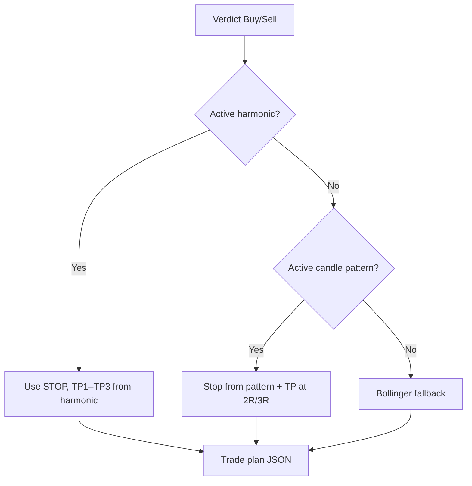

# Trade plan (Phase 2)

When the verdict is **Buy** or **Sell**, Taurus suggests a concrete trade plan: entry, stop-loss, profit targets, and position sizing hint.

## When a plan is shown

| Verdict | Trade plan |
|---------|------------|
| **Buy** | Long setup |
| **Sell** | Short setup |
| **Hold** | No plan — message: wait for clearer setup |

## Priority of sources



### 1. Harmonic pattern (highest priority)

- Pattern direction must match verdict (Buy → bullish, Sell → bearish)
- `stop_hit` must be `false` (pattern still open)
- Uses `STOP`, `TP1`, `TP2`, `TP3` from harmonic backtest
- Entry re-anchored to **current price** from bio; levels stay from pattern

### 2. Candlestick pattern

- Pattern with `Result == "No Hit"` (stop not triggered)
- Signal aligned: Buy → `100`, Sell → `-100`
- Stop from pattern `Stoploss`
- TP1 = 2× risk, TP2 = 3× risk (estimated)

### 3. Bollinger fallback

- No active harmonic or candle setup
- **Buy:** stop = lower band, TP1 = 2R, TP2 = upper band
- **Sell:** stop = upper band, TP1 = 2R, TP2 = lower band
- Skipped if R:R &lt; 1.0

## Output schema

```json
{
  "available": true,
  "symbol": "AAPL",
  "source": "harmonic_pattern",
  "side": "Buy",
  "label": "Gartley (Buy)",
  "entry": 182.50,
  "stop_loss": { "price": 178.20, "change_pct": -2.36 },
  "targets": {
    "tp1": { "price": 188.00, "change_pct": 3.01, "risk_reward": 1.25 },
    "tp2": { "price": 192.50, "change_pct": 5.48, "risk_reward": 2.22 }
  },
  "risk_reward": 1.25,
  "position_hint": {
    "risk_percent": 2.0,
    "portfolio_value": 10000,
    "capital_at_risk": 200.0,
    "shares": 47
  },
  "trailing_stop": {
    "activate_at": 188.00,
    "move_stop_to": 182.50,
    "trail_distance": 4.30,
    "description": "At TP1, move stop to breakeven; then trail 1R below the peak."
  },
  "notes": ["..."],
  "disclaimer": "Advisory only — validate levels before trading."
}
```

When unavailable:

```json
{
  "available": false,
  "symbol": "AAPL",
  "reason": "Hold verdict — wait for a clearer Buy/Sell setup."
}
```

## Position sizing hint

Uses the logged-in user's settings from **Dashboard → Trade plan settings** (`portfolio_value`, `risk_percent`). Anonymous users get defaults:

- Portfolio: **$10,000**
- Risk per trade: **2%**

```
Shares = (portfolio × risk%) / |entry − stop|
```

API: `GET/PATCH /trading-prefs/` (authenticated).

## Trailing stop

Every available plan includes a trailing-stop suggestion:

| Field | Meaning |
|-------|---------|
| `activate_at` | Price level (TP1) to start trailing |
| `move_stop_to` | Breakeven (entry) when TP1 is hit |
| `trail_distance` | 1R — distance to trail after breakeven |

## API

Included in aggregated endpoint:

```
GET /stock/<symbol>/summary/
→ trade_plan
```

No separate endpoint in Phase 2.

## Implementation

| Layer | File |
|-------|------|
| Service | `frontend_app/services/trade_plan.py` |
| Orchestration | `frontend_app/services/stock_summary.py` |
| UI | `displayTradePlan()` in `static/js/display.js` |
| Template | `templates/stock.html` — `#tradePlan` section |

## Testing

```bash
docker compose exec web python manage.py test frontend_app.tests.TradePlanTests
```

## Future enhancements

- [ ] Multiple plans ranked by R:R

Push/email notifications are explicitly **out of scope** for now — deferred to a much later phase.

## Disclaimer

Levels are derived from automated pattern detection and technical rules. Slippage, gaps, and market context can invalidate any plan. Always validate before placing orders.
